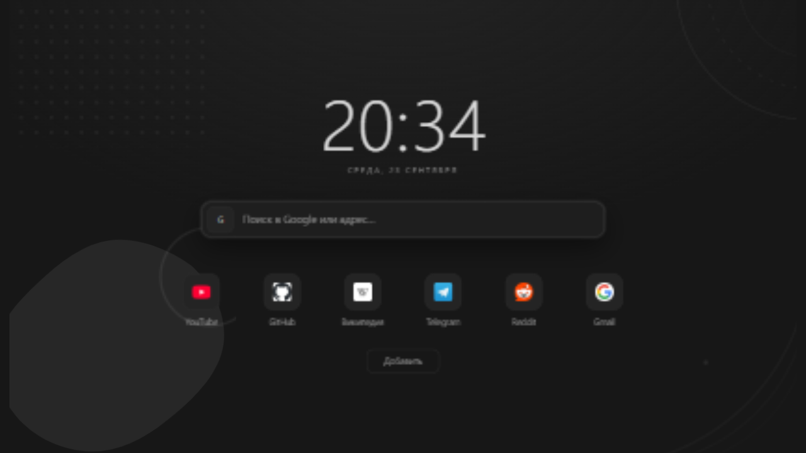
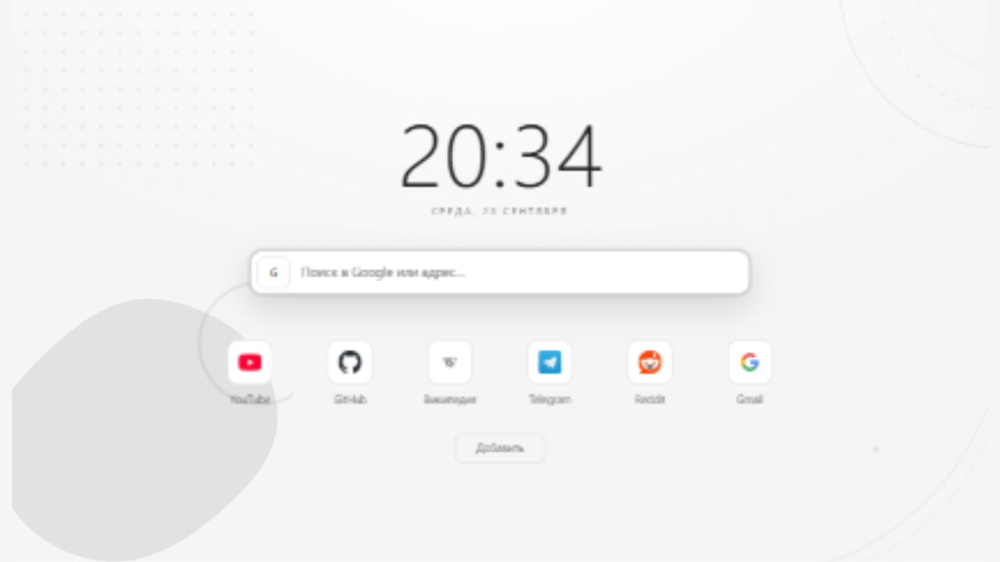

# BroPage

Монохромная стартовая страница — расширение для Brave, Chrome, Edge и других
браузеров на Chromium. Заменяет стандартную новую вкладку: часы, строка
поиска, интерактивные закладки, тёмная и светлая темы. Строго серая палитра,
абстрактные фигуры по краям, ничего лишнего.

## Возможности

- **Часы и дата** — крупные, обновляются каждую секунду.
- **Умная строка поиска** — Google, Яндекс, Bing или DuckDuckGo на выбор;
  если ввести адрес (`example.com`), браузер перейдёт прямо на сайт.
- **Закладки** — добавление, изменение и удаление в пару кликов,
  сортировка перетаскиванием, цветные иконки сайтов (офлайн — буквы).
- **Тёмная и светлая темы** — переключаются в меню расширения и применяются
  к открытым вкладкам мгновенно.
- **Меню расширения** — чекбокс включения страницы и выбор темы.
- **Приватность** — все данные (закладки, тема, поисковик) хранятся только
  в `chrome.storage.local` браузера; наружу ничего не отправляется
  (кроме запроса иконок сайтов у сервиса Google).

## Установка

### Из исходников (режим разработчика)

1. Скачайте или клонируйте репозиторий.
2. Откройте `brave://extensions` (в Chrome — `chrome://extensions`,
   в Edge — `edge://extensions`).
3. Включите **«Режим разработчика»** (переключатель справа вверху).
4. Нажмите **«Загрузить распакованное расширение»** и выберите папку
   проекта.
5. Откройте новую вкладку — страница уже там.

### Без расширения

`index.html` можно открыть и напрямую через `file://` — тогда вместо
`chrome.storage.local` страница использует `localStorage` браузера.

## Использование

| Действие                        | Как                              |
|---------------------------------|----------------------------------|
| Поиск                           | ввести запрос → `Enter`          |
| Переход по адресу               | ввести `example.com` → `Enter`   |
| Фокус на поиск                  | `/` или `Ctrl+K`                 |
| Открыть закладку                | клик по плитке                   |
| Изменить / удалить закладку     | навести на плитку → ✎ / ✕        |
| Поменять порядок закладок       | перетащить плитку                |
| Тема и включение страницы       | значок расширения на панели      |

## Структура

| Файл            | Назначение                                |
|-----------------|-------------------------------------------|
| `manifest.json` | Манифест расширения (Manifest V3)        |
| `index.html`    | Страница новой вкладки: разметка и стили  |
| `app.js`        | Логика страницы                           |
| `popup.html`    | Меню настроек (попап)                     |
| `popup.js`      | Логика попапа                             |
| `icons/`        | Иконки расширения (16 / 48 / 128)         |
| `docs/`         | Скриншоты для README                      |

## Лицензия

[MIT](LICENSE) © [vasidor](https://github.com/vasidor)
